#Gym Booking Application [](https://circleci.com/gh/KrisTovski/gbapp/tree/master)

## Content
* [General info](#general-info)
* [Technologies](#technologies)
* [Application demo](#application-demo)
* [Docker Image](#docker-image)
* [Project Structure](project-structure)
* [Screenshots](#screenshots)
* [REST API](#rest-api)
* [Todo](#todo)

## General info

This "booksy like" app was inspired by a small local gym in my condominium.  
The gym's located in the basement of the block consisting of rooms: gym and cardio.
Due to the small size, there is a limit of people who can exercise at the same time (4 in gym and 3 in cardio).

## Technologies 

* Java 11
* Spring Boot
* Maven
* Hibernate & Spring Data JPA
* MySQL
* H2
* Liquibase
* Spring Security
* Docker
* Thymeleaf
* HTML
* CSS
* Lombok
* Mapstruct
* CircleCi
* Heroku
* REST
* Postman & Swagger

## Application demo
https://gymbookingapp.herokuapp.com/

I used Free Heroku plan so the app sleep automatically after 30 mins of inactivity.
it takes time to wake up and is slow.
But don't be discouraged, just try it out :)

## Docker Image
You can also download the image from dockerhub and run it on your computer. 
In this case, I recommend the development version based on the H2 database. 

```
docker pull -a kristovski/gbapp
```
```
docker run -d -p 8080:8080 -e "SPRING_PROFILES_ACTIVE=dev" kristovski/gbapp:gbapp
```
## Project Structure
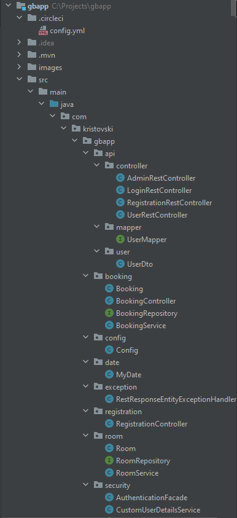
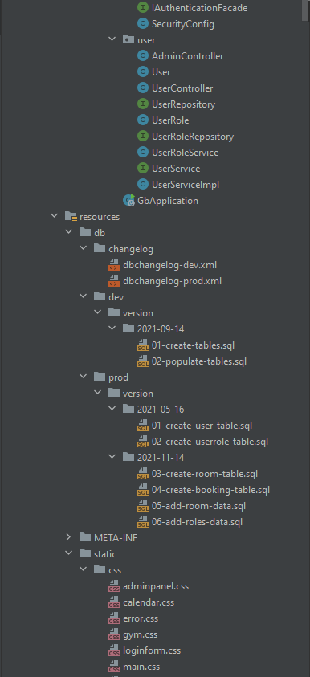
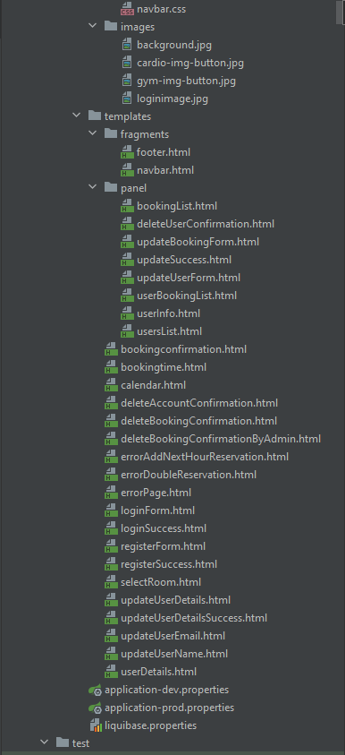
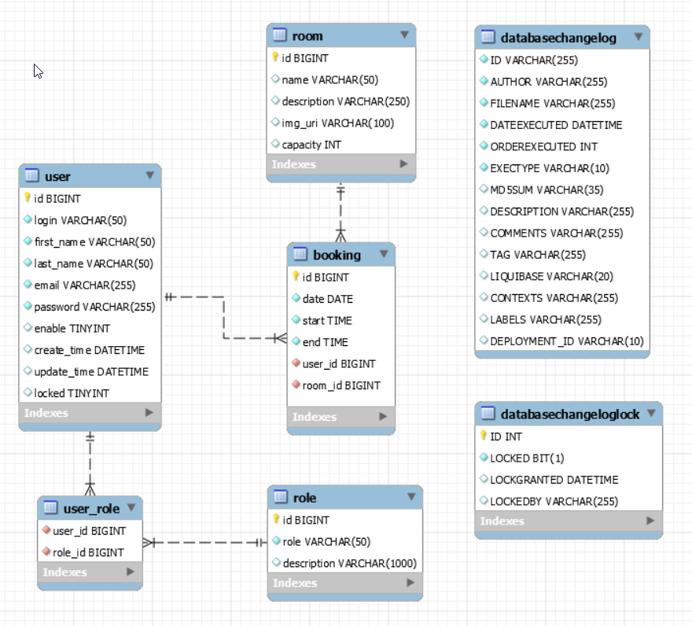

## Screenshots
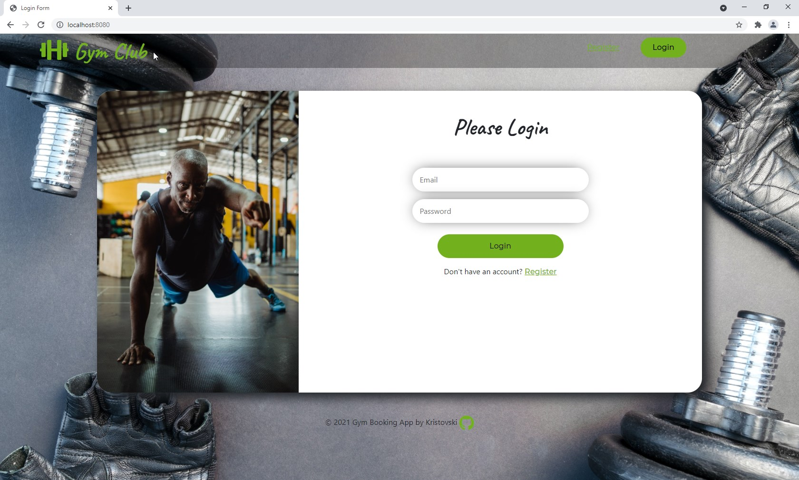
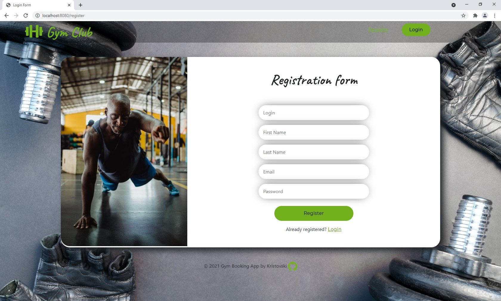
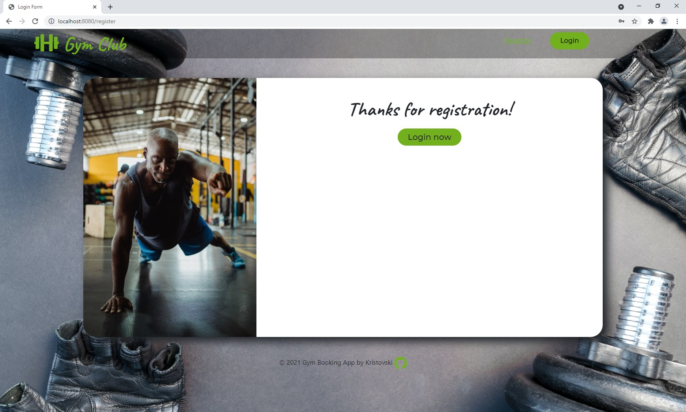
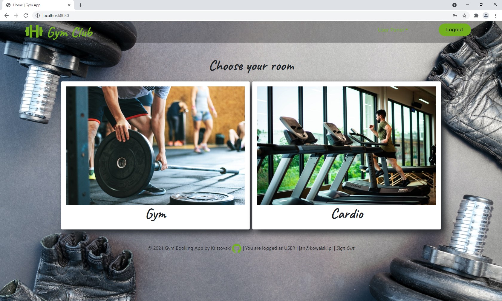
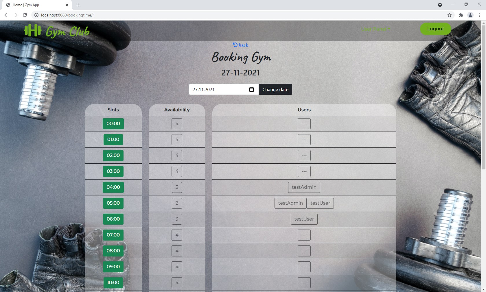
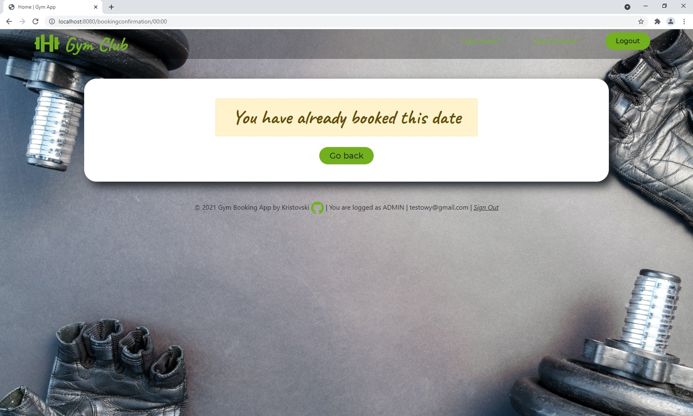
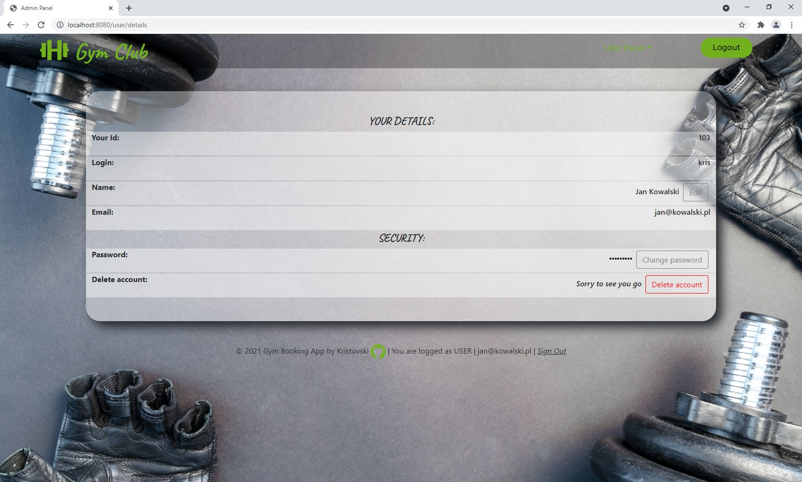
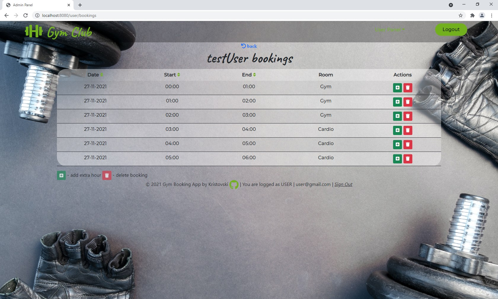
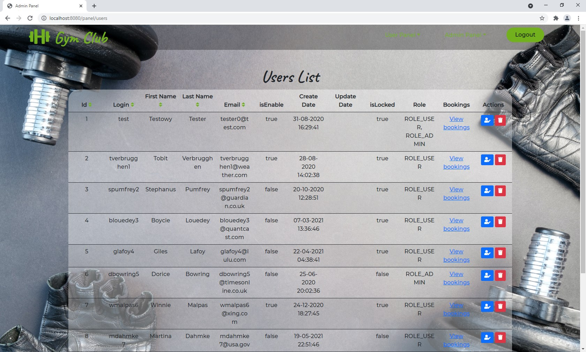
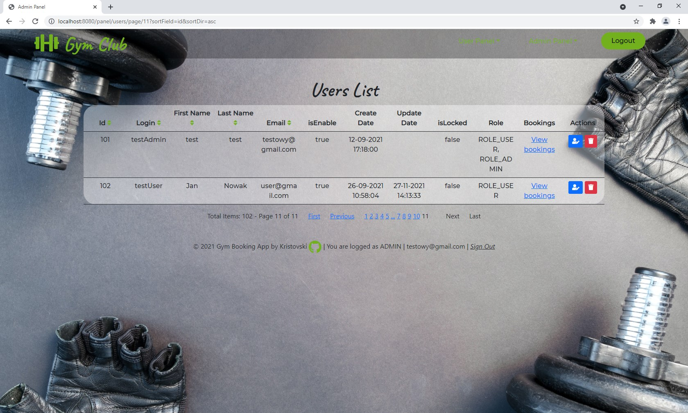
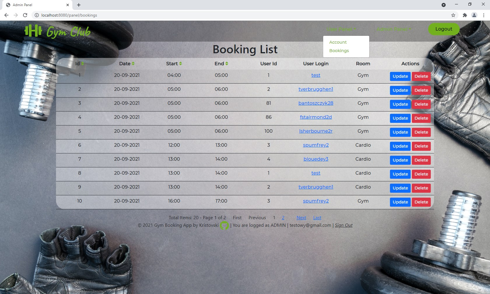
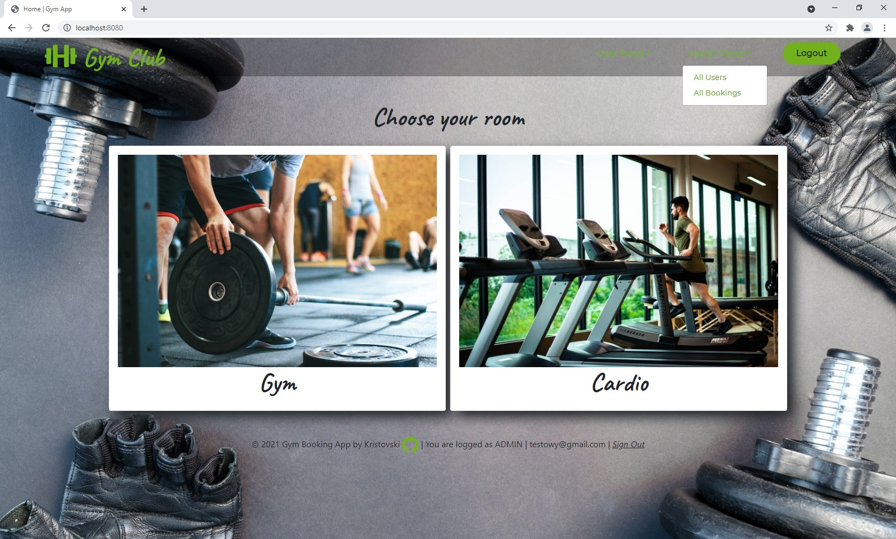

## REST
I decided to extend the application with REST API.
This will allow me to use i.e. Angular, create a mobile application in the future.

WORK IN PROGRESS!

## TODO
* REST API
* send confirmation/activation email
* divide the bookings into the past and the future
* more tests
* refactoring (i.e. errors, exceptions)
* and more features
 

